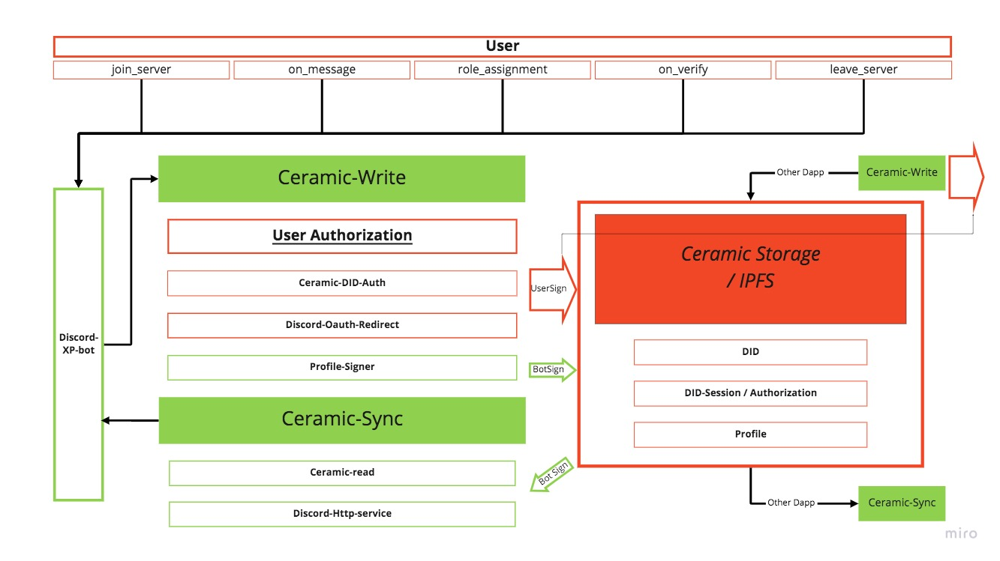

# CREMINI

This is a one-stop repo for [ETHOnline 2022 hackathon](https://online.ethglobal.com/). A [write-up](https://github.com/Mushroom-Lab/hackathon-ethglobal/blob/main/writeup-for-ceramic.md) for using Ceramic is here.

CREMINI empowers user to express Discord activeness on-chain through Ceramic, leveraging the technology of DID session to create data availability while preserving user's ownership.

More about [CREMINI](https://ethglobal.com/showcase/cremini-x9wth) project.

## SYSTEM DESCRIPTION

### Features

- **SEEK** a time-sensitive, revokable authorization from a user for generating a ceramic DID
- **CREATE** a public user profile on ceramic which bind user’s public address, user_id and guild_id
- **SUBSCRIBE** to discord data and make update to user XP (as user send messages) and popularity (as user receive emoji) within a guild.
- **COMMIT** update on user profile on ceramic at specific data check-points.
- **RE-SYNC** user data on ceramic to discord for recovery or account-rebind.
- **OPEN** up a transparent layer of guild-based user data.

### Overview

### Tech Stacks

We approach our goal with the mindset of using micro-services, and modular software engineering with explicit separation of duties. Thus **5 repos/pieces of individual software** are created to work together to achieve the intended system design. Each piece of software is a little process that does simple, straight-forward tasks.

####  **1. Discord Bot**

- [Discord-XP-bot: own bot](https://github.com/Mushroom-Lab/Discord-XP-bot)

This repo is a modified version of https://github.com/KumosLab/Discord-Levels-Bot from KumosLab. On top of the simple XP system using mongoDB, we incorporated the concept of “popularity” that counts the emoji reactions from other users(capped at 1 from each other user on each message). We also added a new bot command that user can use to initialize the Ceramic DID authorization process.

#### **2. Discord Redirect** 

- [DiscordRedirect](https://github.com/Mushroom-Lab/DiscordRedirect)

This repo is a minimal HTTP server using Flask, that offer discord redirection. This exist to improve the UX experience as user would receive custom DM when they initialize the DID authorization process. We also incorporated the Discord official Oauth workflow, to strengthen user’s awareness of authorization. 

#### **3. Discord Http Service**

- [discord-bot-trigger](https://github.com/Mushroom-Lab/discord-bot-trigger)

This repo is a minimal HTTP server using Flask, that offers a few bundled discord API services by using restFUL endpoints. This server exists to complement the subscription-based discord bot and provide a gateway to push data on behalf the discord bot. Some features are direct-message to users, role-assignment etc.

#### **4. Core** **Backend**

- [Mushroom-backend](https://github.com/Mushroom-Lab/mushroom-backend)

This repo is an implementation of backend on [nest.js](https://nestjs.com/). This is the process that interacts with Ceramic storage layer. For example, Discord bot would make call to this backend for updating profile on-chain, and syncing user profile to discord. The Ceramic DID session key is strictly and ONLY consumed in this service. This backend also has its own postgreDB that handles its’ ceramic specific data requirement, separated from any business logic in the discord layer.

#### **5. Frontend**

- [mushroom-demo-frontend](https://github.com/Mushroom-Lab/mushroom-demo-frontend)

This repo is an implementation of frontend on [next.js](https://nextjs.org/). 

### **Regarding Ceramic:**

We rely on Ceramic’s [DIDs Toolkit](https://did.js.org/) to preserve user’s ownership of the data. 

First user creates a did:pkh account fully controlled by the Ethereum address. With this did account, user would sign for a DID session, with which we can update their profile. User could also enable other Dapp to make update to their profile  by sharing the DID 

**Potential Integration with ComposeDB**

In future, (or the next hackathon) We would use ComposeDB to index user’s onchain profile and combine with other data models (e.g. Gitcoin Passport) to create a logic-oriented data aggregation layer on top of Ceramic.
